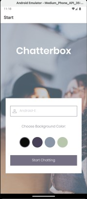
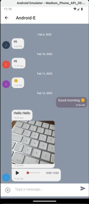
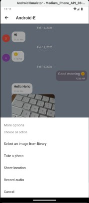

# Chatterbox

A **React Native chat application** built using **Expo**, **Google Firebase**, and the **Gifted Chat** library.  
Chatterbox provides a user-friendly interface for sending text messages, images, location data, and audio recordings.  
It supports offline message storage and is designed with accessibility in mind.

---

## Table of Contents

- [Features](#features)
- [Technology Used](#technology-used)
- [Installation](#installation)
- [How to Use](#how-to-use)
- [Contributing](#contributing)
- [License](#license)
- [Acknowledgements](#acknowledgements)

---

## Features

- **User-friendly Start Screen**
  - Users enter their name and choose a background color before joining the chat.
- **Real-time Chat Interface**
  - Send and receive text messages using Gifted Chat.
  - **Offline Storage:** Messages are cached locally using AsyncStorage so users can view past conversations without internet connectivity.
- **Media Sharing**
  - Send **images** by picking from the device’s library or taking a new photo.
- **Location Sharing**
  - Share your current **GPS location**, which is rendered as a map view.
- **Audio Messaging (Bonus Feature)**
  - Record and send audio messages.
  - Custom audio player with play/pause control, a progress slider, and time display.
- **Firebase Integration**
  - **Firestore Database** for real-time message storage.
  - **Firebase Cloud Storage** for storing images and audio files.
  - **Firebase Authentication** for anonymous login.
- **Gifted Chat Library**
  - Provides a smooth, customizable chat UI.
- **Accessibility**
  - Designed with screen reader support and accessible interactive elements.

---

## Technology Used

- **React Native** – Framework for building cross-platform mobile apps.
- **Expo** – Streamlines development, testing, and deployment.
- **Firebase Services:**
  - **Firestore Database** – For storing chat messages.
  - **Firebase Authentication** – Provides anonymous user login.
  - **Firebase Cloud Storage** – For storing images and audio recordings.
- **Gifted Chat** – For the chat UI.
- **React Navigation** – For screen navigation.
- **react-native-maps** – To display map views for location sharing.
- **Expo AV** – To record and play audio.
- **AsyncStorage** – For local caching of messages.
- **@react-native-community/slider** – For the custom audio player progress slider.

---

## Installation

### Prerequisites

Ensure you have the following installed on your system:

1. **Node.js** (LTS version recommended) – [Download Node.js here](https://nodejs.org/)
2. **npm** (comes with Node.js) or **Yarn** – [Install Yarn](https://yarnpkg.com/getting-started/install)
3. **Android Studio** (for Android emulator) – [Download Android Studio here](https://developer.android.com/studio)
4. **Xcode** (for iOS development, macOS only) – [Download xcode here](https://developer.apple.com/xcode/)
5. **Git** (for version control and working with GitHub) – [Download Git here](https://git-scm.com/)

### Steps

1. **Clone the Repository**

- `git clone https://github.com/JasDevelops/Chatterbox.git`
- `cd Chatterbox`

2. **Install Project Dependencies**

- With npm: `npm install`
- With yarn: `yarn install`

3. **Set up environmental variables**

- Create a `.env`- file in the root directory
- Add your [Firebase](https://console.firebase.google.com/) project credentials to the `.env` file:
  **important:** Ensure `.env` is added to your `.gitignore so that sensitive data isn’t committed.

Example .env file:

```
API_KEY=your_firebase_api_key_here
AUTH_DOMAIN=your_firebase_auth_domain_here
PROJECT_ID=your_firebase_project_id_here
STORAGE_BUCKET=your_firebase_storage_bucket_here
MESSAGING_SENDER_ID=your_firebase_messaging_sender_id_here
APP_ID=your_firebase_app_id_here
```

5. **Start the App with Expo**

`npx expo start`

- To switch to Expo Go: Press `s` in the terminal.
- To run on an Android Emulator: Press `a` in the terminal.
- To run on an iOS Simulator (Mac users only): Press `i` in the terminal.
- To scan and test on a physical device: Use the Expo Go app and scan the QR code.

### Firebase Setup

1. **Create a Firebase Project:**

- Go to the [Firebase Console](https://console.firebase.google.com/).
- Create a new project or select an existing one.

2. **Enable Anonymous Authentication:**

- In the Firebase Console, navigate to Authentication → Sign-in method.
- Enable Anonymous.

3. **Set Up Firestore Database:**

- Create a Firestore database and configure basic security rules.

4. **Set Up Firebase Cloud Storage:**

- Enable Cloud Storage and configure the rules to allow authenticated access during development.

5. **Add Firebase Configuration:**

- Copy your Firebase config from the Firebase Console (Project settings → General)  and add it to your `.env` file as described above.

---

## How to Use

### Enter a Name & Select a Background Color

- On the start screen, enter your name and choose a chat background color.
- Press "Start Chatting" to enter the chat room.



### Send Messages

- Type text in the input field at the bottom.
- Press the Send button or use the return key to send.

### Send Images

- Tap the "+" icon to open an actions menu.
- Choose "Select an image from library" or "Take a photo".
- The image is uploaded to Firebase Storage, and a download link is sent in the chat.

### Share Location

- Tap "Share location" in the actions menu.
- The app requests location permission. If allowed, your current GPS location is sent and displayed as a small map preview.

### Record and Send Audio (Bonus Feature)

- Tap "Record audio" in the actions menu.
- The app requests microphone permission and starts recording.
- Press OK (in the alert) to stop recording and upload the audio.
- A message with a small "Play Audio" button is sent to the chat.





### Offline Message Storage

- Read or listen to conversations even without an internet connection.
- When you reconnect, new messages are synced with Firestore.

---

## Contributing

Contributions are welcome!

### To contribute:

1. Fork this repository.
2. Create a new branch (`git checkout -b feature-branch`).
3. Make your changes and commit (`git commit -m "Added a new feature"`).
4. Push to the branch (`git push origin feature-branch`).
5. Open a pull request.

---

## License

This project is licensed under the MIT License.

---

## Acknowledgements

- My tutor and mentor at **[CareerFoundry](https://careerfoundry.com/)** for providing guidance and support.
- The developers behind **[React Native Gifted Chat](https://github.com/FaridSafi/react-native-gifted-chat)** for the chat UI library.
- **[Expo](https://expo.dev/)** for making React Native development a bit easier.
- **[Firebase](https://firebase.google.com/)** for offering a backend solution.
